# day05 APP逆向入门

**讲师：武沛齐（微信 wupeiqi666）**

```
- APP逆向入门，快速了解逆向是怎么回事（引子）
	- Mac，m1和m2的看，无法动手操作。
	- Win、Mac，动手操作。
	
- Java开发基础，看得懂别人代码逻辑。
- 安卓开发基础，如何开发一个app（Java层+C语言）
- 一大波案例
	- 使用之前学习的Java、安卓、C知识
	- 新知识点
- 专题
	- 抓包
	- unidbg
	- root监测和反调试
	- 脱壳
- 打包和交付
```


**今日目标**：以案例为驱动，了解逆向到底是怎么回事？

案例：

- 臧航准备网，自动登录。
- 爱安丘，自动注册。
- 油联合伙人，自动登录（算法&签名）。


## 1.臧航准备网

### 1.1 安卓设备

- 真机（需root）

- 模拟器，电脑上安装软件模拟手机。

  ```
  win: 逍遥、夜神、网易mumu、雷电（推荐3版本，不要用4版，抓包会有问题）。
  mac: 网易mumu（暂不支持m1)
  
  win同学安装模拟器时，开启vt。
  	https://mumu.163.com/include/16v1/2016/06/27/21967_625825.html
  ```


### 1.2 安装app


### 1.3 抓包软件 charles

#### 1.3.1 安装

- mac用户

  ```
  访问网址 https://xclient.info/s/charles.html 根据提示下载并破解。
  ```

- windows用户：

  ```
  注册码
  	Registered Name:  https://zhile.io
  	License Key:      48891cf209c6d32bf4
  ```


#### 1.3.2 配置【http】

##### PC端

打开 【Proxy】>【Proxy Settings】设置代理IP端口：


查看charles所在的PC的IP地址：

打开 【Help】>【Local IP...】设置代理IP端口：


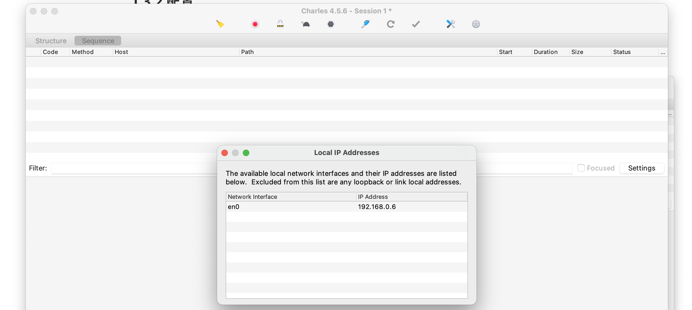


打开 【Proxy】>【SSL Proxy Settings】设置代理IP端口：

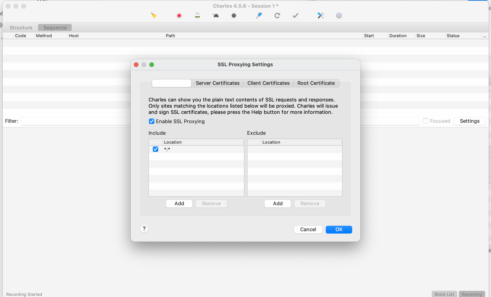


##### 手机端（模拟器）


注意：按照上述过程安装后。

- 手机中app，发送的Http，抓包软件是可以抓到。【http请求】
- 手机中app，发送的https请求，目前是抓不到。


### 1.4 抓包


### 1.5 代码实现

```python
import requests

res = requests.post(
    url="http://cd.tibetairlines.com.cn:9100/login",
    data={
        "grant_type": "password",
        "isLogin": True,
        "password": 'sb123',
        "username": 'alex,C',
    }
)
res.close()

print(res.text)
```


## 2.爱安丘


### 2.1 安装app


### 2.2 抓包

正常抓包应该是这样，但是你那里应该无法抓到。因为：这个app发送的https请求，需要配置证书才能抓包。


#### 2.2.1 charles配置【https】

##### PC端

打开 【Proxy】>【SSL Proxying Settings】开启HTTPS：(http + ssl)

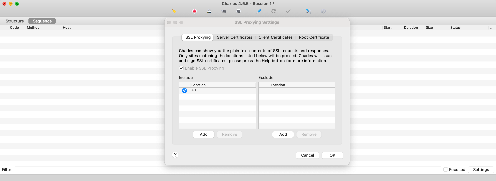


接下来需要在手机上安装证书。

- 安卓7版本以下：非常简单。【模拟器】
- 安卓7版本及以上：证书在安装在系统证书，root权限（将证书放到系统目录）【**下节讲**】

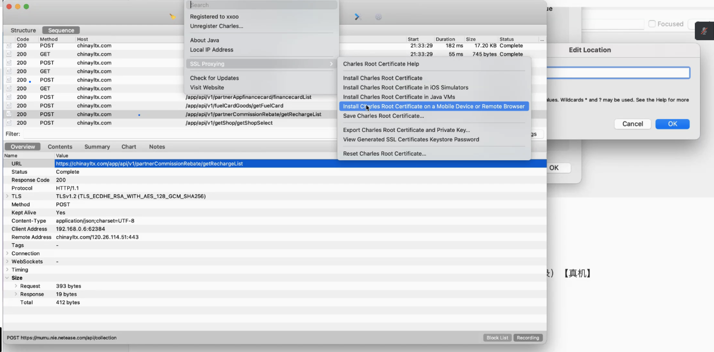


##### 手机端（模拟器）

打开浏览器输入网址，下载并安装证书。

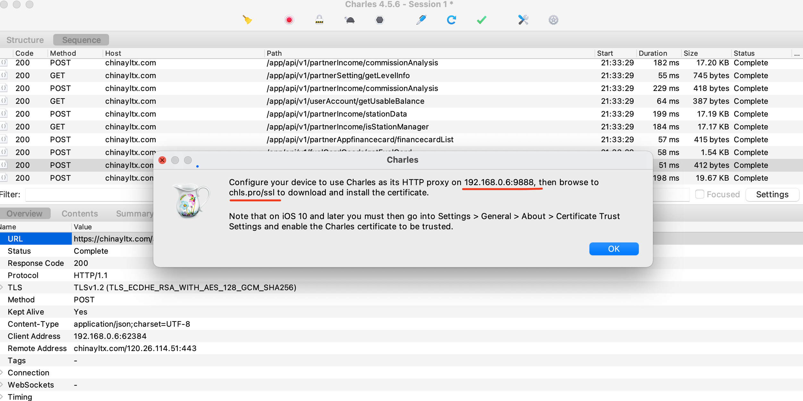


#### 2.2.2 正常抓包


### 2.3 实现代码

#### 2.3.1 imei

imei，国际移动设备识别码，通常所说的手机序列号、手机“串号”，用于在移动电话网络中识别每一部独立的手机等移动通信设备，相当于移动电话的身份证。

可以通过代码随机生成IMEI。

```python
import random
import string

def gen_imei():
    return "".join(random.choices(string.digits + 'abcdef', k=16))

imei = gen_imei()
```


#### 2.3.2 发送短信

```python
import requests
import random
import string


def gen_imei():
    return "".join(random.choices(string.digits + 'abcdef', k=16))


imei = gen_imei()

session = requests.Session()
session.cookies.set("orgid", "137")
session.headers.update({
    "cq-agent": '{"os":"android","imei":"%s","osversion":"6.0.1","network":"none","version":"0.0.28.108","core":"1.6.4"}' % imei,
    "user-agent": "chuangqi.o.137.com.iqilu.app137/0.0.28.108",
    "orgid": "137"
})

phone_num = input("请输入手机号：")

res = session.post(
    url="https://app-auth.iqilu.com/member/phonecode",
    json={
        "phone": phone_num
    }
)
res.close()
res_dict = res.json()
# {'code': 1, 'data': 'a77yXYVQcKHYdf64e+MUntjZ/yZGgZSksWxdEqhBDfk='}
print(res_dict)
```


#### 2.3.3 登录&注册

```python
import requests
import random
import string


def gen_imei():
    return "".join(random.choices(string.digits + 'abcdef', k=16))


imei = gen_imei()

session = requests.Session()
session.cookies.set("orgid", "137")
session.headers.update({
    "cq-agent": '{"os":"android","imei":"%s","osversion":"6.0.1","network":"none","version":"0.0.28.108","core":"1.6.4"}' % imei,
    "user-agent": "chuangqi.o.137.com.iqilu.app137/0.0.28.108",
    "orgid": "137"
})

phone_num = input("请输入手机号：")

res = session.post(
    url="https://app-auth.iqilu.com/member/phonecode",
    json={
        "phone": phone_num
    }
)
res.close()
res_dict = res.json()
# {'code': 1, 'data': 'a77yXYVQcKHYdf64e+MUntjZ/yZGgZSksWxdEqhBDfk='}
key = res_dict['data']
code = input("请输入手机接收到的验证码：")

res = session.post(
    url="https://app-auth.iqilu.com/member/login",
    json={
        "phone": phone_num,
        "code": code,
        "key": key,
        "password": "",
        "captcha": "",
        "captchaKey": ""
    }
)
res.close()
print("登录结果->", res.text)
```


## 3.油联合伙人

### 3.1 安装app

下载并安装软件。

- 豌豆荚下载地址：https://www.wandoujia.com/apps/8051276
- 百度网盘：课件目录（其他资料包）。


### 3.2 抓包


```
请求方式：POST
请求地址：https://chinayltx.com/app/api/v1/partnerLogin/login
请求体：
	phone=18630087660
	password=e10adc3949ba59abbe56e057f20f883e
请求头：
	X-App: native
    X-Noncestr: 123456
    X-OS: partnerApp_android
    X-Req-Time: 1650980779832
    X-Sign: 645b299fc29998e390d60d95a9b1ac5a
    X-Token: 
    X-UserID: 
```

接下来要解决：

- password是怎么加密的？
- X-Sign是怎么加密？


### 3.3 反编译工具

- apk文件，本质就是压缩包（代码）。

- 反编译工具，反编译成java代码，分析java代码。例如：jadx、jeb、gda。

  ```
  反编译工具都依赖jre（java运行环境），直接安装JDK（包含jre）。
  ```


#### 3.3.1 jdk

需要在你的电脑上安装Java开发工具包JDK，JDK中包含JRE。

```
https://www.oracle.com/java/technologies/downloads/

# 请务必安装 JDK8==JDK1.8（后期工具需要）
https://www.oracle.com/java/technologies/downloads/#java8
```


安装好之后需要配置下环境变量。


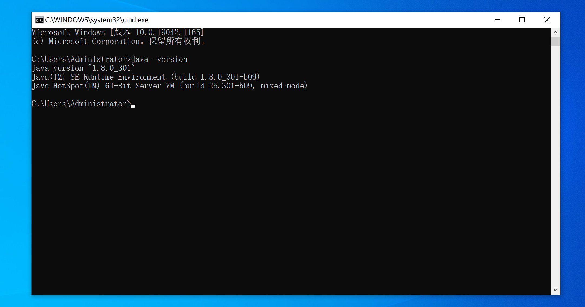


关于mac系统，自带JDK：


```
/Library/Java/JavaVirtualMachines 
```


#### 3.3.2 jadx

- 直接去官网

  ```
  https://github.com/skylot/jadx/releases
  ```

- 去课件的网盘
  


注意：代码、文件尽量不要让他存在中文路径。

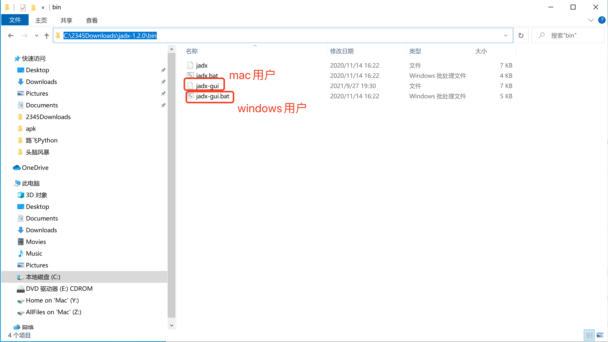

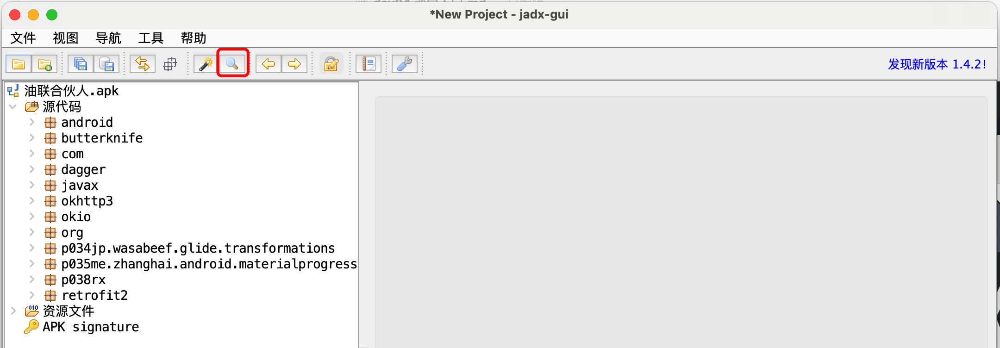


### 2.4 逆向

```
请求方式：POST
请求地址：https://chinayltx.com/app/api/v1/partnerLogin/login
请求体：
	phone=18630087660
	password=e10adc3949ba59abbe56e057f20f883e
请求头：
	X-App: native
    X-Noncestr: 123456
    X-OS: partnerApp_android
    X-Req-Time: 1650980779832
    X-Sign: 645b299fc29998e390d60d95a9b1ac5a
    X-Token: 
    X-UserID: 
```

接下来要解决：

- password是怎么加密的？
- X-Sign是怎么加密？


#### 2.4.1 password算法

根据特点去搜索，可能搜到很多东西。

```
password    "password"     password=
phone
/v1/partnerLogin/login
```


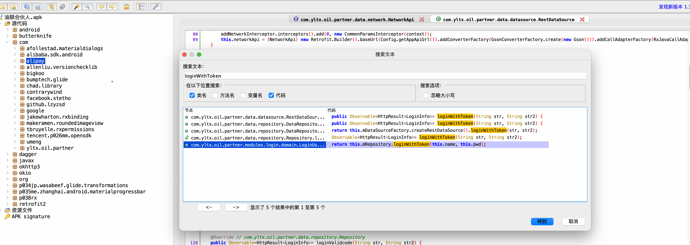

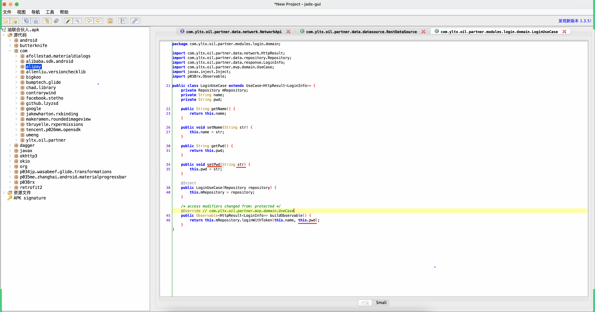


按理说md5加密：

- 明文：123456
- 密文：e10adc3949ba59abbe56e057f20f883e

```python
import hashlib

obj = hashlib.md5()
obj.update("123456".encode('utf-8'))
res = obj.hexdigest()
print(res) # e10adc3949ba59abbe56e057f20f883e
```


#### 2.4.2 X-Sign算法

```
X-Sign
```

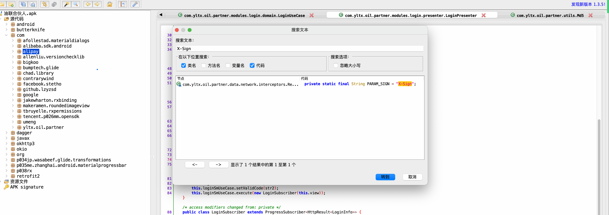


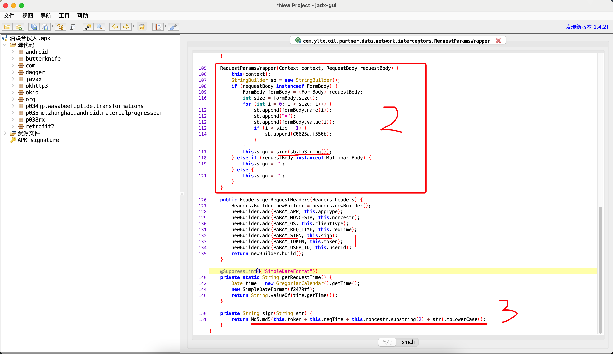


```python
import hashlib

token = ""
reqTime = "1657201079926"
nonce_str = "123456"
nonce_str_sub_2 = nonce_str[2:]
body_string = "phone=18630099999&password=4297f44b13955235245b2497399d7a93"

encrypt_string = f"{token}{reqTime}{nonce_str_sub_2}{body_string}"

obj = hashlib.md5()
obj.update(encrypt_string.encode('utf-8'))
res = obj.hexdigest()
print(res)
```


### 2.5 实现代码

```python
import time
import hashlib

import requests


def md5(data_string):
    obj = hashlib.md5()
    obj.update(data_string.encode('utf-8'))
    return obj.hexdigest()


def run():
    phone = input("请输入手机号：")
    password = input("请输入密码：")
    encrypt_password = md5(password)

    token = ""
    req_time = str(int(time.time() * 1000))
    nonce_str = "123456"
    nonce_str_sub_2 = nonce_str[2:]
    body_string = f"phone={phone}&password={encrypt_password}"
    encrypt_string = f"{token}{req_time}{nonce_str_sub_2}{body_string}"

    sign = md5(encrypt_string)

    res = requests.post(
        url="https://chinayltx.com/app/api/v1/partnerLogin/login",
        data={
            "phone": phone,
            "password": encrypt_password,
        },
        headers={
            "X-App": "native",
            "X-Noncestr": nonce_str,
            "X-OS": "partnerApp_android",
            "X-Req-Time": req_time,
            "X-Sign": sign,
            "X-Token": token,
            "X-UserID": ""
        }
    )

    print(res.text)


if __name__ == '__main__':
    run()
```


## 总结

1. app逆向到底是在干什么？

   ```
   - 抓包 & 分析
   - 反编译apk，分析代码，算法找到
   - Python还原算法，实现自动操作
   ```

2. 反编译apk，如何找到算法的位置？

   ```
   本质就是根据  现象+java语基础+安卓开发+经验 -> 猜测并验证。
   
   所以，想要以后自己定位app中的算法，必须要掌握：
   - java基础，看得懂逆向出来的代码。
   - 安卓开发，了解安卓开发常见流程，看到某些现象就知道接下来怎么找。
   - 经验，多实践（自己找和听讲区别很大，老师背后可能花了很多时间才找到）
   - 还原算法，用python实现java中的算法。
   ```

3. 涉及知识点

   ```
   - 设备
   - 抓包（http请求 + 安卓7以下的https）
   - 反编译
   - 逆向（你现在还不懂java和安卓，看不懂，所以，后续会先将java和安卓，再讲逆向案例）
   ```

   

