# 谷歌Pixel手机：刷机+root+证书

**讲师：武沛齐（微信 wupeiqi666）**

线上文档：https://zhuanlan.zhihu.com/p/598414059

Pixel手机相关内容：

- **刷机**，官方包。
- ROOT
- 集成charles证书


本节手把手带大家完成对自己新买的Piexl手机进行刷机（**Pixel所有机型通用**）。


**刷机的意义**：

*以后手机系统出问题，可以自如的重新刷自己喜欢的安卓系统（安卓8/9/10/11/12等）*


**注意**：务必购买oem解锁的手机，否则无法刷机。

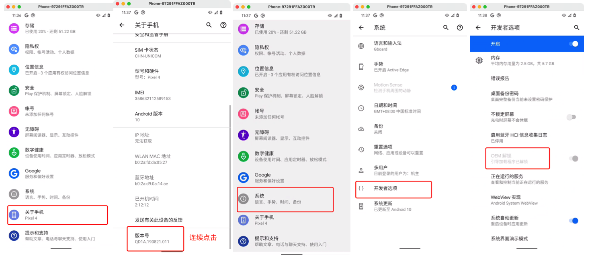


刷机本质需要三个步骤：

- 安装adb和bootloader
- 下载系统包
- 刷入系统


# 1.adb和fastboot

在刷机的过程中需要使用adb 和 fastboot命令来连接手机，并对手机下发相关指令。

所以，必须在刷机前确保自己电脑上已有adb和fastboot。

如何安装呢？

## 1.1 platform-tools

下载platform-tools（压缩包）内部包含adb 和 fastboot。

地址：https://developer.android.google.cn/studio/releases/platform-tools


但是有些同学会发现，自己电脑上下载的最新版 `platform-tools` 无法使用，此时可以选择下载低一点的版本。

**推荐：r30.0.5版本**

```
https://dl.google.com/android/repository/platform-tools_r30.0.5-windows.zip
https://dl.google.com/android/repository/platform-tools_r30.0.5-linux.zip
https://dl.google.com/android/repository/platform-tools_r30.0.5-mac.zip
```


## 1.2 解压

platform-tools是一个压缩包，解压后就是一个普通的文件夹（内部包含adb、fastboot）。

将解压后的文件夹拷贝到指定目录（当做安装目录），不要有中文路径。


## 1.3 环境变量

为了以后更加方便的使用adb和fastboot，我要讲将platform-tools的目录加入到系统环境变量。

- win系统：
  

- mac系统：将以下两行代码，添加到你的 `~.zprofile`文件中

  ```
  PATH="/Library/Android/sdk/platform-tools:${PATH}"
  export PATH
  ```

  

  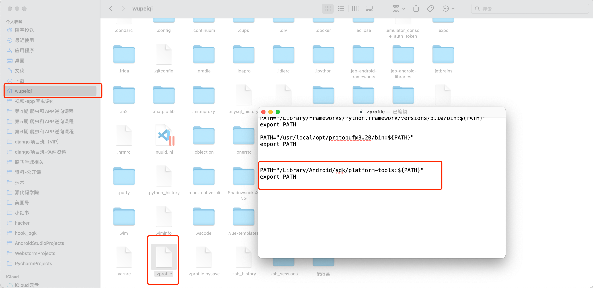

- ubuntu系统：将一下两行代码加入到`~/.bashrc `文件中。

  ```
  export PATH=~/platform-tools:$PATH
  alias sudo="sudo env PATH=$PATH"
  ```

  

  

  

  

## 1.4 测试adb和fastboot

- win

  ```
  adb --version
  fastboot --version
  ```

  

- mac

  ```
  adb --version
  fastboot --version
  ```

  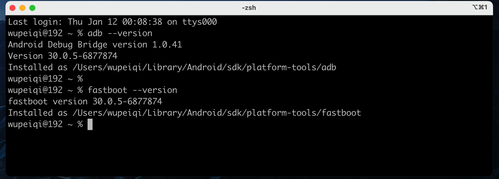

- ubuntu

  ```
  sudo adb --version
  sudo fastboot --version
  ```

  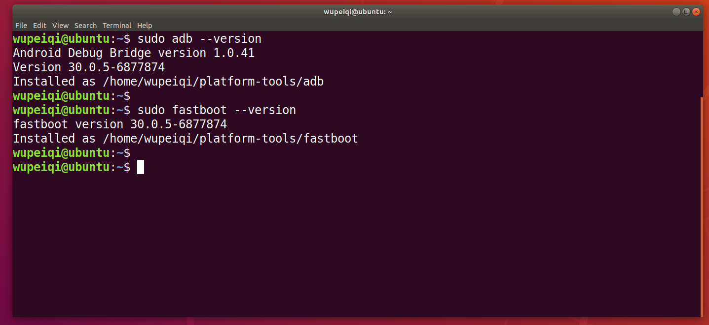

  注意：在ubuntu上如果不配置root用户组，必须使用sudo来运行adb和fastboot，否则后续会提示无法连接手机，例如：
  


## 1.5 连接手机

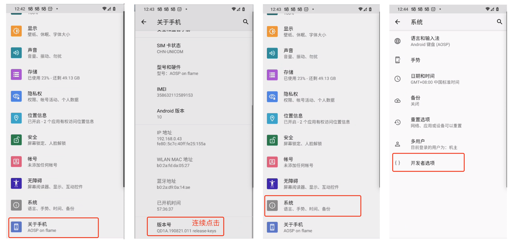

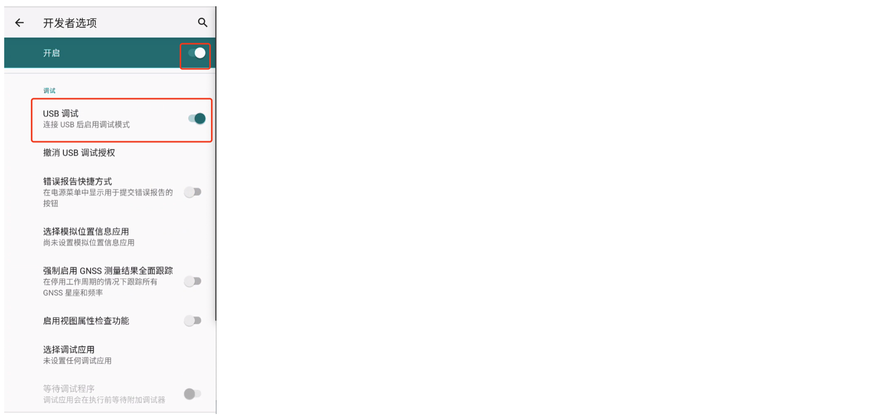


开启手机的USB调试，然后：

- 用数据线连（官方线）接手机和电脑，会提示是否授权窗口，点击授权。

  ```
  尽量使用官方自带的数据线，不要用自己网上几块钱买的。
  ```

- 打开终端输入 `adb devices`查看是否连接：

  ```
  win和mac系统：adb devices
    ubuntu系统：sudo adb devices
  ```

  

看到设备信息，则表示连接成功。。。


如果你是**windows操作系统**，可能一直无法显示连接的设备，可能是因为电脑为安装谷歌USB驱动导致。

例如：fastboot devices 无法读取到设备。


## 1.6 谷歌USB驱动

### 1.6.1 下载

https://developer.android.google.cn/studio/run/win-usb.html?hl=zh-cn

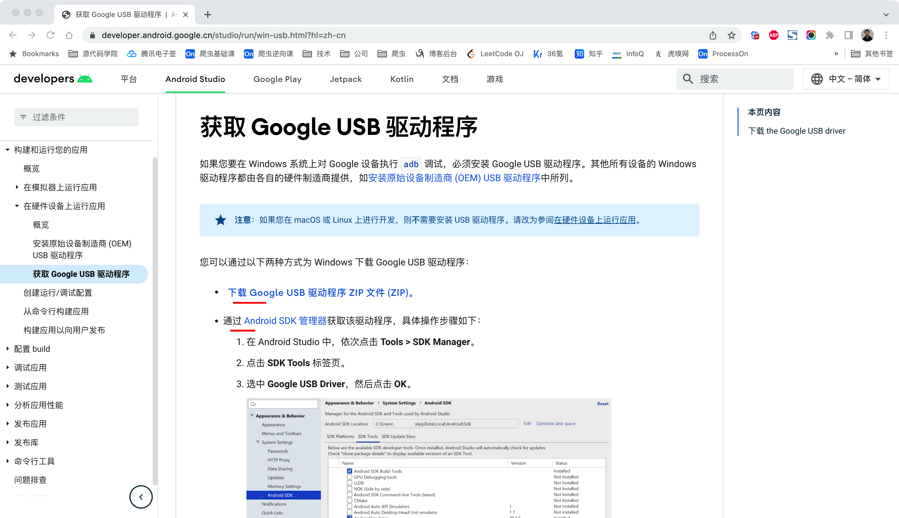

### 1.6.2 安装

https://developer.android.google.cn/studio/run/oem-usb?hl=zh-cn#InstallingDriver


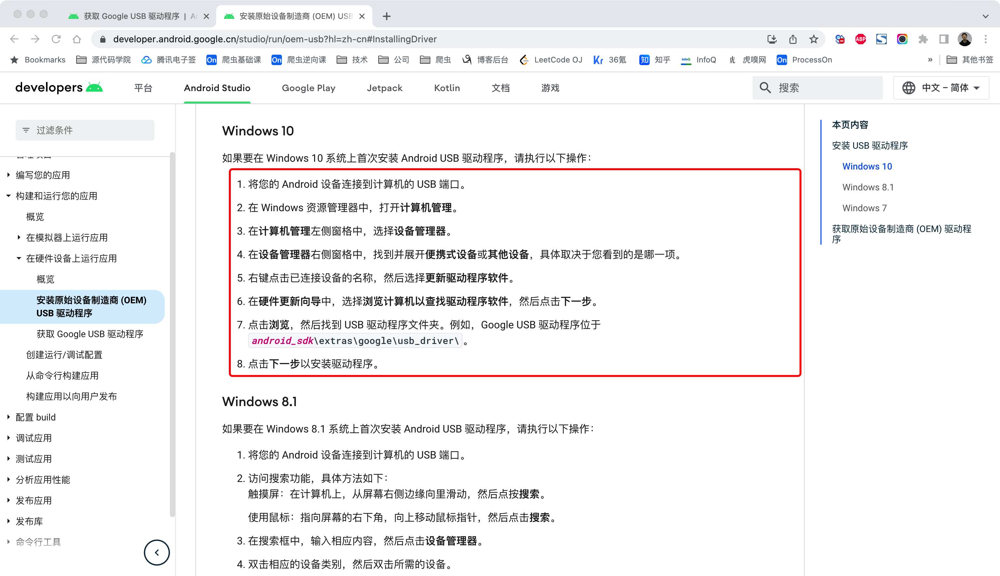


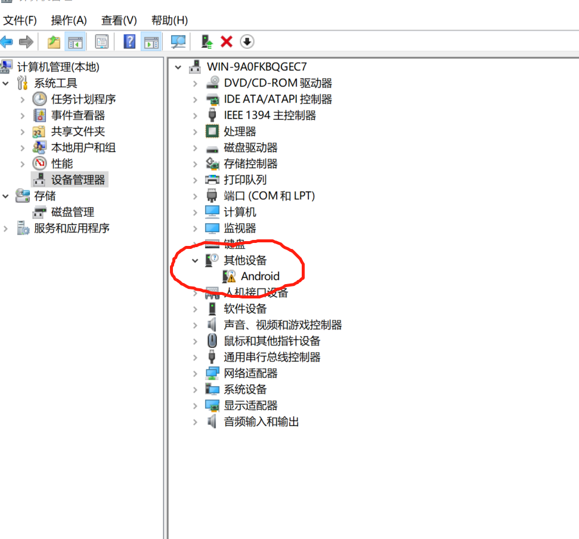

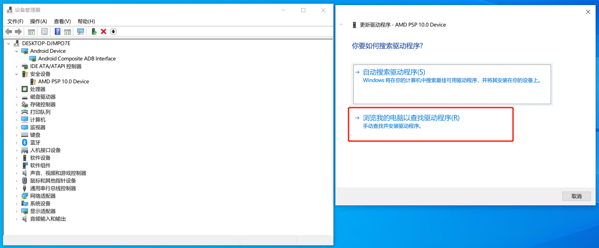

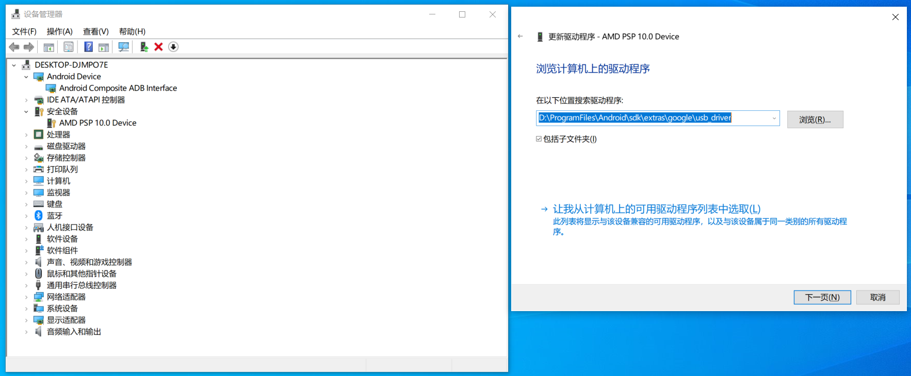


驱动安装成功后，就可以正常使用 adb 和 fastboot了。。。


# 2.系统包

## 2.1 下载

根据自己的机型，下载自己希望刷系统版本的镜像包。

https://developers.google.com/android/images?hl=zh-cn#flame


注意：科学网上工具推荐

```
下载链接（推荐使用浏览器访问）
	https://bitbucket.org/letsgogo/letsgogo_10/src/master/README.md
备用链接（推荐使用浏览器访问）：
	https://github.com/LetsGo666/LetsGo_2
	
安装后打开填写我的ID：95239424 你还能多得3天会员！
```


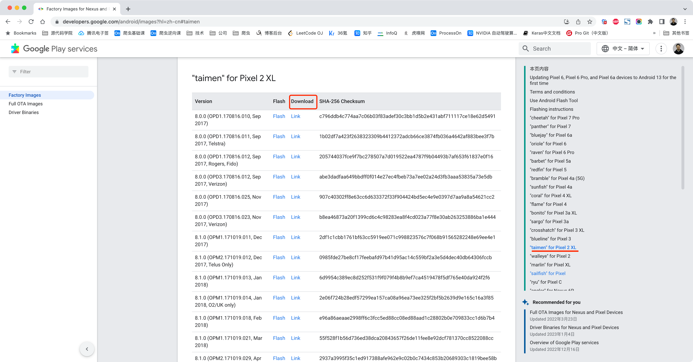


## 2.2 解压

- win系统：使用`flash-all.bat` 进行刷机

- mac/ubuntu系统：使用 `flash-all.sh` 进行刷机。


# 3.刷机

刷机本质上需要两个步骤：

- 让手机进入bootloader
- 基于fastboot讲下载系统镜像刷入到手机


## 3.1 bootloader

让手机进入bootloader有两种方式：

- adb方法（推荐）

  ```
  - 手机通过USB线连接电脑
  - adb 连接上手机
  - 执行命令让手机重启并进入bootloader
  	>>>adb reboot bootloader 
  
  注意：如果是ubuntu系统，则执行 sudo adb reboot bootloader 
  ```

  

- 手机按键

  ```
  - 先将手机关机
  - 在关机状态下，长按：开机键 + 音量下键  
  
  稍等片刻，手机将键入bootloader状态。
  ```

  

手机进入Bootloader状态显示：

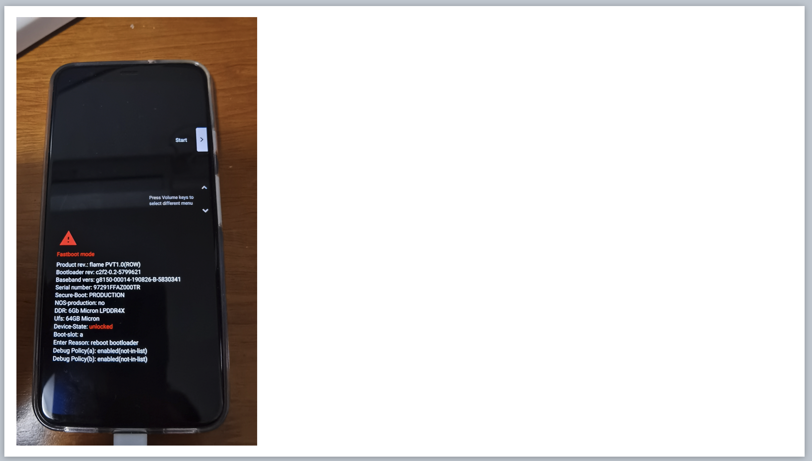


## 3.2 刷机

当手机进入bootloader状态后，接下来就需要基于fastboot来进行刷机，具体步骤如下：

- 基于USB线将手机连接至电脑

- 电脑终端执行命令，查看手机是否与电脑连接上。

  ```
  >>>fastboot devices
  注意：ubuntu系统使用 sudo fastboot devices
  ```

  

- 终端进入系统包解压的路径

  ```
  cd ....
  ```

  

- 执行刷机命令

  ```
  mac或ubuntu系统：
  	>>>./flash-all.sh
  windows系统：
  	>>>flash-all.bat
  ```


执行命令后，手机将开始自动进行刷机，等待刷机完成后，会自动重启。。。

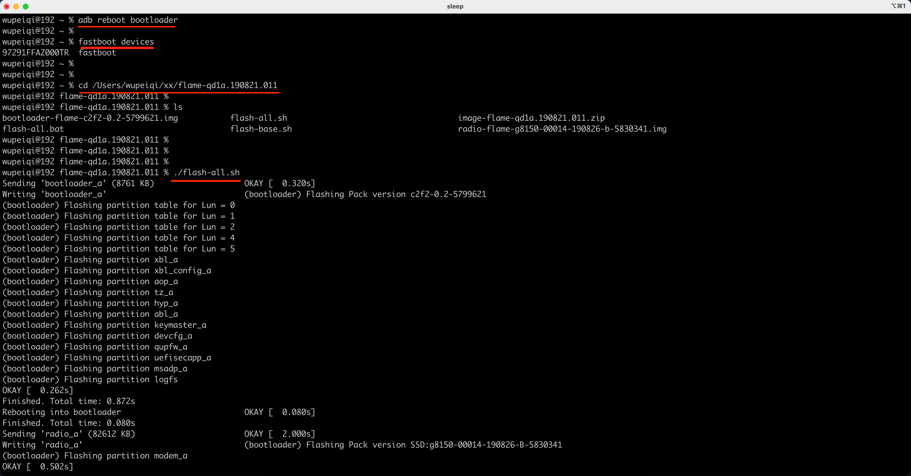

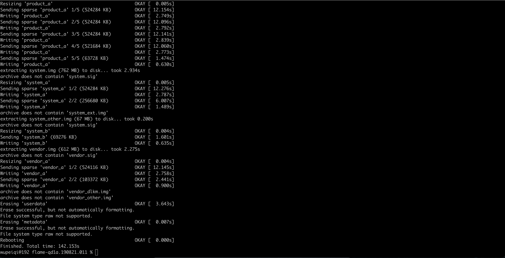


## 3.3 成功

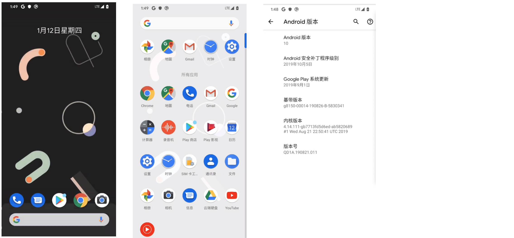


以后如果手机有任何问题，都可以使用此方法重新刷机，不用担心，尽情的鼓捣你的手机吧。。。


