# day07 证书和Java基础

**讲师：武沛齐（微信 wupeiqi666）**


**今日概要**

- 抓包时https证书问题【非pixel手机同学】

  ```
  模拟器（安卓6）
  	证书安装在用户级别，就可以抓取https证书。
  真机（安卓7）
  	系统级别的证书
  	安卓7及以上手机证书必须安装【系统级别的证书】
  	ROOT
  	证书 -> 系统级别
  ```
  
- Java基础

  ```
  之前学习app逆向入门，发现如果想要做好逆向，必须要会分析Java代码。
  所以我接下来需要先学一点java基础。
  
  注意：目标不是做java开发，而是看懂会分析即可。
  ```


# 1.https证书


## 1.1 手机root

手机root就是获得最高权限，app逆向必备，一般现在的手机root有3种方式：

- FastBoot刷Magisk（无法解锁system分区）【推荐】

  ```
  https://www.bilibili.com/video/BV1er4y1C7wU/
  https://magiskcn.com/
  ```

- 第三方Rec twrp刷Magisk（第三方rec更新不及时，有些机型会不支持）

  ```
  https://www.bilibili.com/video/BV1Ly4y1u7YE/
  ```

- 淘宝找人代刷（30-50左右）

**注意**：因大家各自机型不同，请自行解决root问题。


## 1.2 证书问题

想要在PC上通过抓包软件，抓取app中请求相关数据包。

- 安卓7以下（上一节模拟器上操作）

  - http，直接配置代理。
  - https，直接安装证书。

- 安卓7及以上

  - 未解锁system分区

    ```
    
    ```
  - 手机获取root权限
    - 在面具Magisk中刷入MoveCertificates
    - 安装用户级别证书
    - 重启手机，MoveCertificates会将用户级别证书拷贝到系统证书
    ```

    ```
    
  - 已解锁system分区
  
    ```
    - 手机获取root权限 & 已解锁system分区
    - 下载证书
    - 处理证书
    - 证书 放到设备的 系统证书目录（root）
    ```


### 1.1 已解锁System分区

手机必须已root且已解锁System分区才能做如下操作。


#### 1.1.1 导出证书

导出证书并保存到指定目录。

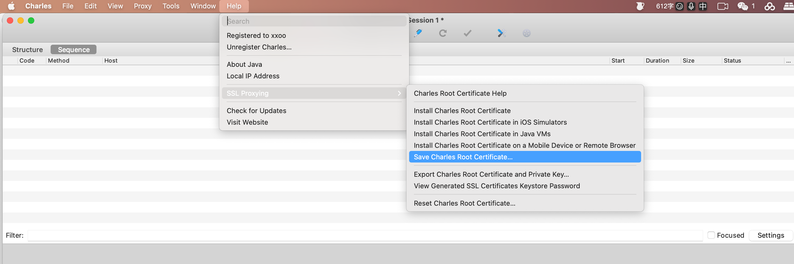


#### 1.1.2 处理证书文件

##### 1.安装OpenSSL

需要提前在自己电脑上下载并安装 OpenSSL。

http://slproweb.com/products/Win32OpenSSL.html


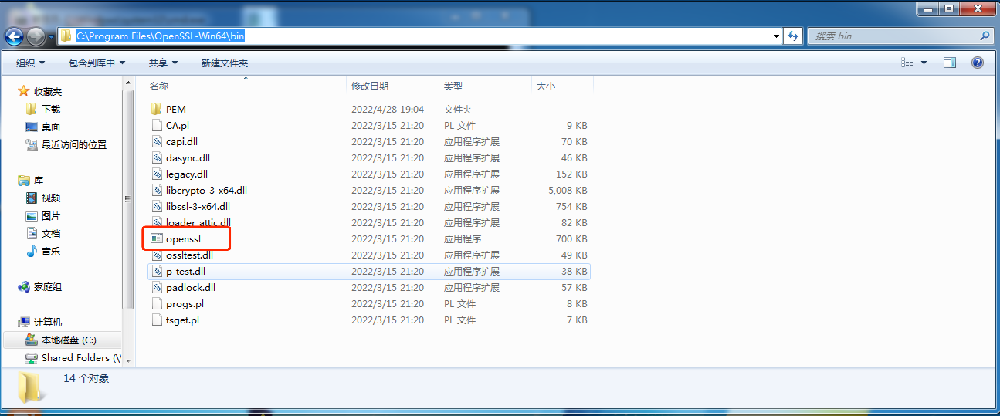


##### 2.处理证书

在终端运行：

```
>>>D:
>>>openssl工具  x509 -subject_hash_old -in  证书文件路径
```

例如：

```
>>>C:
>>>"C:\Program Files\OpenSSL-Win64\bin\openssl"  x509 -subject_hash_old -in charles-ssl-proxying-certificate.pem
```

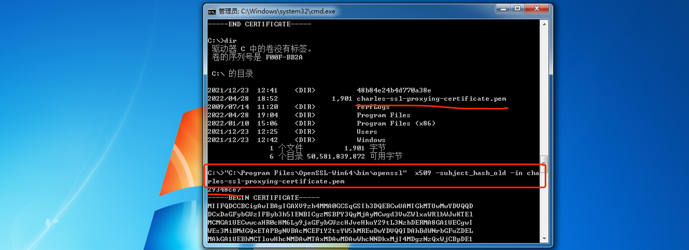


mac系统：

```
>>>cd ~/Documents/
>>>openssl x509 -subject_hash_old -in charles-ssl-proxying-certificate.pem
```

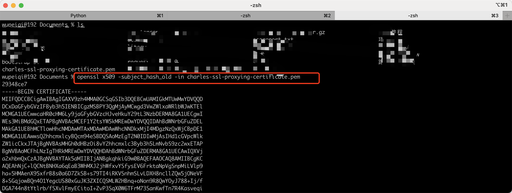


##### 3.重命名

将证书文件重命名。

- 原名称：`charles-ssl-proxying-certificate.pem`

- 重命名：`处理证书得到的字符串.0`

  ```
  上个步骤执行的得到字符串为：29348ce7 ，所以，需要重命名为：29348ce7.0
  ```


注意：显示文件的扩展名。


#### 1.1.3 安装设备系统证书

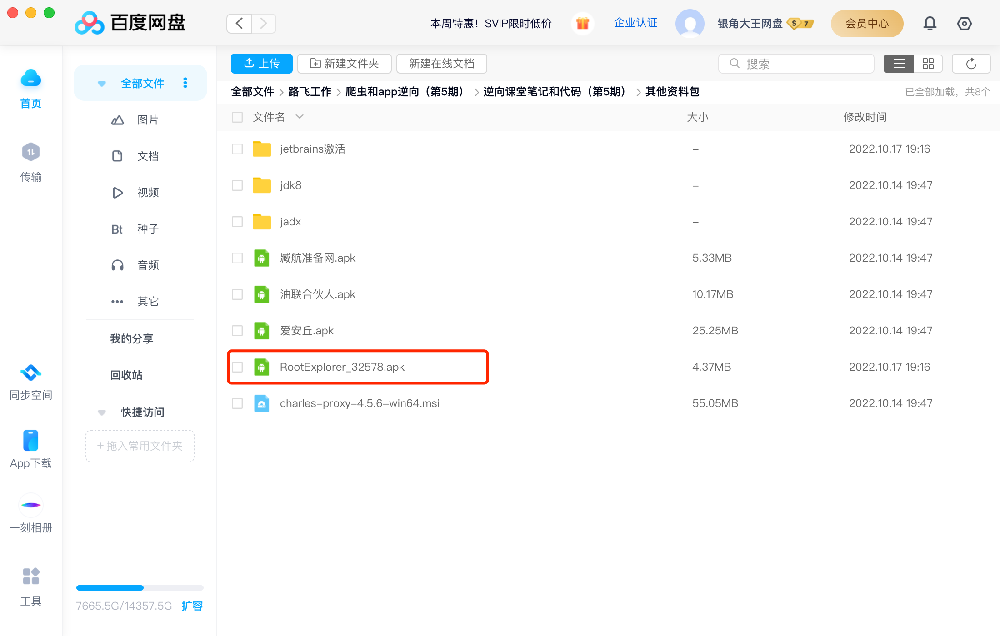


将上述处理好的证书文件 `29348ce7.0` 放到安卓设备的 `/system/etc/security/cacerts/` 目录下。

- 先将文件传到手机的 `/sdcard/`目录

- 在手机上安装 Root Explorer 管理器 ，`RootExplorer_32578.apk` 见网盘

- 打开 `Root Explorer 管理器` ，返回根目录并挂载读写权限 & 将证书拷贝到系统目录。

  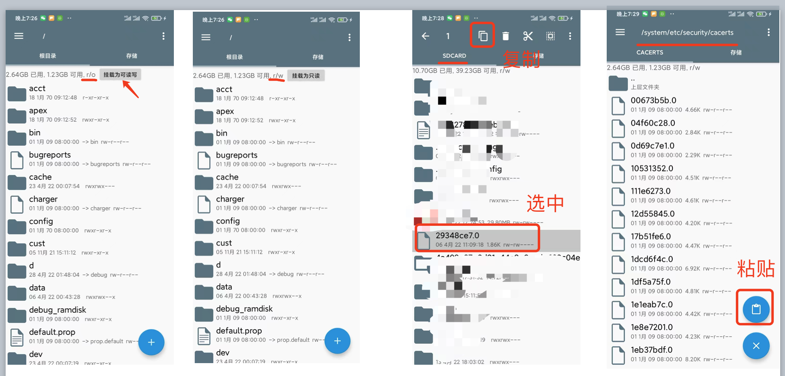

- 执行完成后，回到根目录，将权限修改会 r/o 权限。

  


至此，你的抓包软件就可以抓取 设备 上的**https**包了。


注意：**手机必须root才能做上述操作**。另外，因为手机型号不同，操作可能不同，如遇问题，请结合网络资源自行调整。

- 手机，请结合网络资源自行调整。
- 不是所有的包都能抓到，有些app防止你抓包（油联、B站）。


### 1.2 未解锁

手机已root，未解锁System分区。


#### 1.2.1 安装用户证书


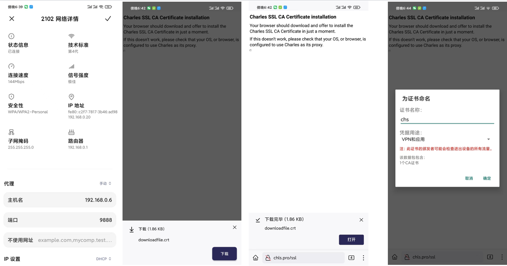

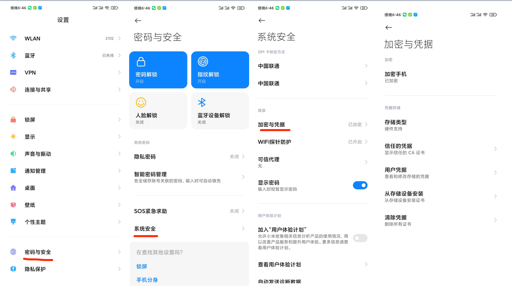


#### 1.2.2 Move Certificates模块

在面具中刷入Move Certificates模块，帮我们实现自动将用户证书移动到系统证书。

```
提前去课件的网盘下载Move Certificates模块，并保存至手机上。
```

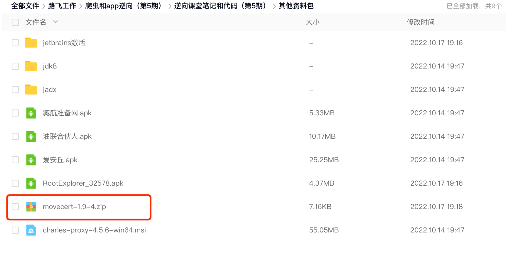


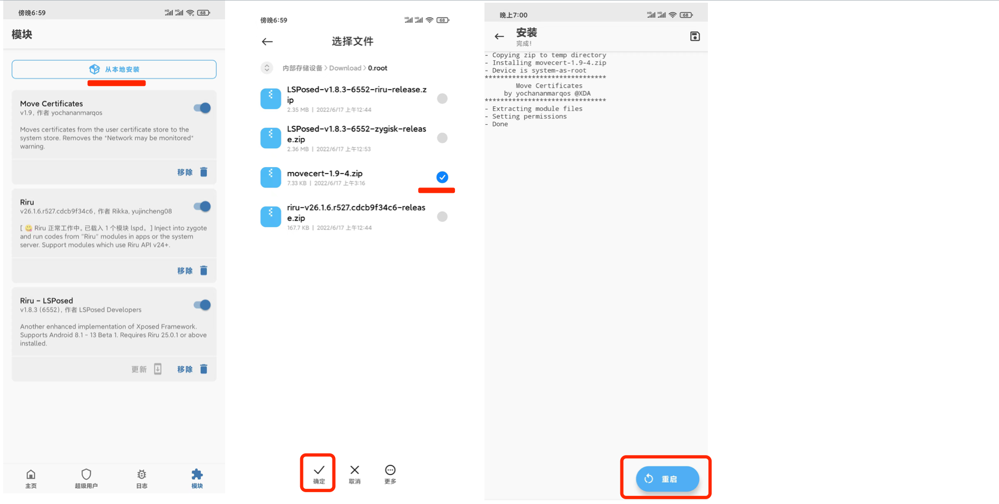


再次查看系统凭证，就有了。


证书安装成功后，就可以开始抓包了。


# 2.Java入门

以后能看得懂Java代码，会分析即可。

> 学习Python经验：
>
> - 安装Python
> - 编程语言的语法
> - 安装Pycharm（IDE）
>
> Java学习：
>
> - 解释器/编译器
> - Java语法
> - IDE编写Java代码


## 2.1 环境搭建

- Python，解释型编程语言。

  ```python
  # xx.py
  print("爬虫逆向开发")
  print("结束")
  ```

  ```
  >>>Python解释器的路径 代码文件的路径
  >>>C:\python39\python.exe  代码文件的路径
  
  C:\python39\加入环境变量。
  >>>python xx.py
  ```

- Java，编译型&解释型语言。（编译型 vs 解释器）

  ```java
  // Hello.java
  String name = "武沛齐";
  
  System.out.println(name);
  ```

  在执行代码时，需要对代码先进行编译。

  ```
  >>>java安装bin目录下javac  Hello.java
  >>>javac Hello.java
  
  Hello.class
  ```

  编译完成之后，你会得到一个文件 `Hello.class`，去运行代码。

  ```
  >>>java Hello
  ```


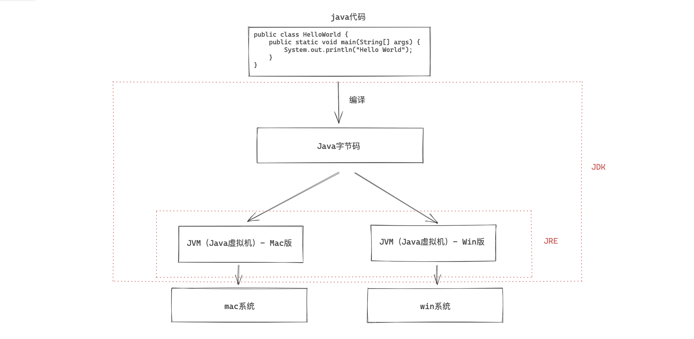

- **JRE**，（ Java Runtime Envrionment ），Java 运行时环境。

  ```
  含JVM和运行必备的类库。
  
  电脑上想要运行java程序，就必须安装JRE。
  ```

- **JDK**，（ Java Development Kit ），Java开发工具。【包含JRE】【Java开发】

  ```
  含JRE 和 开发必备的工具。
  工具包含：编译工具javac.exe 和 运行工具java.exe
  想要开发Java应用程序，就必须安装JDK。
  ```

  

接下来，我们就来下载和安装吧。

```
JDK8（jdk 1.8）版本（目前最新已到17）

官方地址：https://www.oracle.com/java/technologies/downloads/#java8
百度云盘：资源目录
```


安装好之后需要配置下环境变量。


关于mac系统，自带JDK：


```
/Library/Java/JavaVirtualMachines 
```


编写代码+编译+运行：

- 编写Java代码：Hello.java

  ```java
  public class Hello {
      public static void main(String[] args) {
          System.out.println("Hello World");
      }
  }
  ```

- 打开终端去运行命令

  ```
  >>>javac Hello.java
  >>>java Hello
  ```


## 2.2 Inteliji

编写Java代码时建议大家使用IDE（集成开发环境）来提供开发效率。

- 下载，建议【2020.1.1版本】

  ```
  https://www.jetbrains.com/idea/download/other.html
  ```

- 激活【2020.1.1版本】

  ```
  视频：https://www.zhihu.com/zvideo/1254435808801050624
  激活包：在网盘共享目录，其他共享资料包文件夹【jetbrains-agent-latest.zip】
  ```

- 2021版本

  ```
  https://www.bilibili.com/video/BV1JP411V7Gv/?spm_id_from=333.999.0.0
  ```

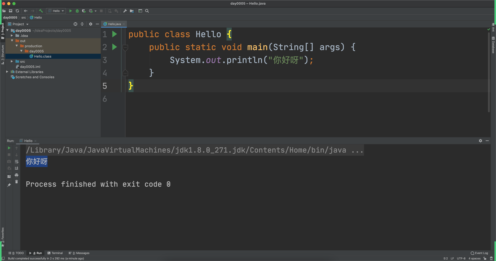


## 2.3 Java基础语法

初步代码的分析：`Hello.java`

```java
public class Hello {
    public static void main(String[] args) {
        System.out.println("你好呀");
    }
}
```

- 主函数 & 程序的入口。

  ```python
  def func():
      pass
  
  if __name__ == "__main__":
  	func()
  ```

- 文件名

  ```
  一个文件中最多只能有一个public类 且 文件名必须和public类名一致。
  如果文件中有多个类，文件名与public类名一致。
  如果文件中有多个类 且 无public类，文件名可以是任意类名。
  ```

- 类名

  ```
  首字母大写且驼峰式命名，例如：Hello、UserInfo、PersonApplication
  ```

- 类修饰符：public、default（不写）

- 类中成员修饰符：public、private、protected、default（不写）

- 静态成员，无序实例化就可以指定调用。

  ```java
  class MyTest{
  
      public void f1(){
          System.out.println("f1");
      }
  
      public static void f2(){
          System.out.println("f2");
      }
  }
  
  public class Hello {
  
      public static void main(String[] args) {
          MyTest.f2();
          
          //1.实例化
          MyTest obj = new MyTest();
          // 2.对象调用
          obj.f1();
  
      }
  }
  ```

  

  ```java
  class Person{
      public static void f1(){
          // 静态方法
          System.out.println("我是F1函数");
      }
  }
  
  public class Hello {
      public static void main(String[] args) {
          Person.f1();
      }
  }
  ```

  ```java
  class Person {
      public void f2() {
          // 实例方法
          System.out.println("我是F1函数");
      }
  }
  
  public class Hello {
      public static void main(String[] args) {
          // 实例化对象  obj = Person();
          Person obj = new Person();
  
          // 对象调用f2
          obj.f2();
      }
  }
  ```

- void表示方法没有返回值

  ```java
  class MyTest{
  
      public int f1(){
          System.out.println("f1");
  
          return 123;
      }
  
      public static String f2(){
          System.out.println("f2");
          return "哈哈哈";
      }
  }
  
  public class Hello {
  
      public static void main(String[] args) {
  
          MyTest obj = new MyTest();
          int v1 = obj.f1();
  
          String v2 = MyTest.f2();
      }
  }
  
  ```

- 参数

  ```java
  class MyTest {
  
      public int f1(int a1, int a2) {
          int result = a1 + a2;
          return result;
      }
  
  }
  
  public class Hello {
  
      public static void main(String[] args) {
          MyTest obj = new MyTest();
          int v1 = obj.f1(1, 2);
      }
  }
  ```

  

**补充：**

```python
Python 官方源代码不也有java这样写的么？

def func(a1,a2):
	return a1 + a2

# 建议
def foo(a1: str a2:int) -> int
	return 1

foo(11,22)
```


### 2.3.1 注释

```java
/**
 * 对这个类进行注释
 */
public class Hello {

    /**
     * 这个方法是干嘛....
     * @param v1 大小
     * @param v2 尺寸
     * @return 返回一个xxx
     */
    public static String getSign(int v1, String v2) {
        return "哈哈哈";
    }

    public static void main(String[] args) {
        // 单行注释 # 
        // int age = 18;

        /* 多行注释 """sdfafd"""
        String name = "武沛齐";
        int size = 18;
         */
    }
}
```

注意：JavaScript


### 2.3.2 变量和常量

```java
public class Hello {

    public static void main(String[] args) {
        String name = "武沛齐";
        name = "alex";

        int age = 19;
        age = 20;

        final int size = 18;
    }
}
```

```python
v1 = [111,22]
v2 = 345
```


### 2.3.3 输入和输出

```java
import java.util.Scanner;

public class Hello {

    public static void main(String[] args) {
        // 输入
        Scanner input = new Scanner(System.in);
        String text = input.nextLine();

        // 输出 line
        System.out.println(text);
        // System.out.print(text);
    }
}
```


```java
import java.util.Scanner;

public class Hello {

    public static void main(String[] args) {
        // 输出
        System.out.print("请输入：");

        // 输入
        Scanner input = new Scanner(System.in);
        String text = input.nextLine();

        // 输出
        System.out.println(text);
    }
}
```


### 2.3.4 条件语句

```java

public class Hello {

    public static void main(String[] args) {
        int age = 19;

        if (age < 18) {
            System.out.println("少年");
        } else if (age < 40) {
            System.out.println("大叔");
        } else {
            System.out.println("老汉");
        }

    }
}
```

```java
public class Hello {

    public static void main(String[] args) {
        int score = 19;

        switch (score) {
            case 10:
                System.out.println("xxx");
                System.out.println("xxx");
                System.out.println("xxx");
                break;
            case 20:
                System.out.println("xxx");
                System.out.println("xxx");
                System.out.println("xxx");
                break;
            default:
                System.out.println("xxx");
                break;
        }

    }
}
```


### 2.3.5 循环语句

while循环

```java
public class Hello {

    public static void main(String[] args) {
        
        int count = 0;
        while (count < 3) {
            System.out.println("执行中...");
            count += 1;
        }
    }
}
```


do while循环（至少执行1次）

```java
public class Hello {
    public static void main(String[] args) {
        
        int count = 0;
        do {
            System.out.println("执行中...");
            count += 1;
        } while (count < 3);
        
    }
}
```


for循环

```java
public class Hello {

    public static void main(String[] args) {
        
        for (int i = 0; i < 10; i++) {
            System.out.println("哈哈哈");
        }
        
    }
}
```

```java
public class Hello {

    public static void main(String[] args) {        
        String[] nameList = {"修仙", "肖峰", "麻子", "十分"};
        // nameList.length   4
        // nameList[0]

        for (int idx = 0; idx < nameList.length; idx++) {
            String ele = nameList[idx];
            System.out.println(ele);
        }
    }
}
```

注意：也支持break/continue。


## 2.4 数据类型


### 2.4.1 整数类型

- byte，字节		  【1字节】表示范围：-128 ~ 127 即：`-2^7 ~ 2^7 -1  `  
- short，短整型    【2字节】表示范围：-32768 ~ 32767
- int，整型             【4字节】表示范围：-2147483648 ~ 2147483647
- long，长整型      【8字节】表示范围：-9223372036854775808 ~ 9223372036854775807

```java
public class Hello {

    public static void main(String[] args) {
        byte v1 = 32;
        short v2 = 10000;
        int v3 = 22221331;
        long v4 = 554534353424L;
    }
}
```


**提醒：**逆向时有一些字符串是通过字节数组来表示（UTF-8编码）

```
v1 = "武沛齐"
v2 = [230, 173, 166, 230, 178, 155, 233, 189, 144]

```

```java
import java.util.Arrays;

public class Hello {

    public static void main(String[] args) {
        // 1.字节数组（转换为字符串） [字节,字节,字节]
        byte[] dataList = {97, 105, 100, 61, 50, 52, 54, 51, 56, 55, 53, 55, 49, 38, 97, 117, 116, 111, 95, 112, 108, 97, 121, 61, 48, 38, 99, 105, 100, 61, 50, 56, 57, 48, 48, 56, 52, 52, 49, 38, 100, 105, 100, 61, 75, 82, 69, 104, 69, 83, 77, 85, 74, 104, 56, 116, 70, 67, 69, 86, 97, 82, 86, 112, 69, 50, 116, 97, 80, 81, 107, 55, 87, 67, 104, 67, 74, 103, 38, 101, 112, 105, 100, 61, 48, 38, 102, 116, 105, 109, 101, 61, 49, 54, 50, 55, 49, 48, 48, 57, 51, 55, 38, 108, 118, 61, 48, 38, 109, 105, 100, 61, 48, 38, 112, 97, 114, 116, 61, 49, 38, 115, 105, 100, 61, 48, 38, 115, 116, 105, 109, 101, 61, 49, 54, 50, 55, 49, 48, 52, 51, 55, 50, 38, 115, 117, 98, 95, 116, 121, 112, 101, 61, 48, 38, 116, 121, 112, 101, 61, 51};
        
        String dataString = new String(dataList);
        System.out.println("字符串是：" + dataString);

        // 2.字符串->字节数组
        try {
            // Python中的  name.encode("gbk")
            String name = "武沛齐";
            byte[] v1 = name.getBytes("GBK");
            System.out.println(Arrays.toString(v1)); // [-50, -28, -59, -26, -58, -21]
            
            // Python中的  name.encode("utf-8")
            byte[] v2 = name.getBytes("UTF-8");
            System.out.println(Arrays.toString(v2)); // [-26, -83, -90, -26, -78, -101, -23, -67, -112]
        } catch (Exception e) {

        }
    }
}

```


需求来了：某个app逆向，在Java代码中得到一个字节数组 `[-50,-28,-59,-26,-58,-21]`，请通过Python代码将这个字节数组转换成字符串？

> - 在Java中的字节范围：-128~127；Python中字节的范围：0~255。
>
>   ```
>     Java  0  1   2  3  4 .. 127 -128 -127 -126    -3  -2  -1     
>   Python  0  1   2  3  4 .. 127  128  129  130 ...253 254 255
>   ```
>
>   ```
>     java, 有符号：-128~127
>   python，无符号：0~255
>   ```
>
>   ```
>   byte_list = [-50,-28,-59,-26,-58,-21]
>   ```
>
> - 让数字转化弄成字节并拼接起来 bytearray

```python
# Python脚本，方便你们以后使用。
byte_list = [-50, -28, -59, -26, -58, -21]

bs = bytearray()  # python字节数组
for item in byte_list:
    if item < 0:
        item = item + 256
    bs.append(item)

str_data = bs.decode('gbk')  # data = bytes(bs)
print(str_data)
```

```python
data_list = [-26, -83, -90, -26, -78, -101, -23, -67, -112]

num_list = bytearray()
for i in data_list:
    if i < 0:
        i = i + 256
    num_list.append(i)

text = num_list.decode('utf-8')
print(text)
```


### 2.4.2 字符

```java
char v1 = 'x';
char v2 = '武';

String = "武沛齐";
```

注意：字符串是由多个字符串组成。


### 2.4.3 字符串

定义字符串

```java
import java.io.UnsupportedEncodingException;

public class Hello {

    public static void main(String[] args) throws UnsupportedEncodingException {
        String v1 = "武沛齐";
        String v2 = new String("武沛齐");

        String v4 = new String(new byte[]{-26, -83, -90, -26, -78, -101, -23, -67, -112});
        String v5 = new String(new byte[]{-50, -28, -59, -26, -58, -21}, "GBK");
        
        String v6 = new String(  new char[]{'武', '沛', '齐'}   ) ;
    }
}
```


字符串中的方法：

```java
public class Hello {

    public static void main(String[] args) {
        String origin = "alex是个大DB";

        char v1 = origin.charAt(5); // 指定字符
        int len = origin.length();  // 长度
        for (int i = 0; i < len; i++) {
            char item = origin.charAt(i);
        }

        String v2 = origin.trim(); // 去除空白
        String v3 = origin.toLowerCase(); // 小写
        String v4 = origin.toUpperCase(); // 大写
        String[] v5 = origin.split("是"); // 分割
        String v6 = origin.replace("D", "S"); // 替换
        String v7 = origin.substring(2, 6);  // 子字符串=切片 [2:6]
        boolean v8 = origin.equals("alex是个大SB"); // "alex是个大DB" "alex是个大SB"
        
        boolean v9 = origin.contains("el");
        boolean v10 = origin.startsWith("a");
        String v11 = origin.concat("哈哈哈");
    }
}
```

```python
name = 'alex'
if name == 'sb':
    pass
```


字符串拼接

```java
import java.io.UnsupportedEncodingException;

public class Hello {

    public static void main(String[] args) {
        // "name=alex&age=18"
        StringBuilder sb = new StringBuilder();  // StringBuffer线程安全
        sb.append("name");
        sb.append("=");
        sb.append("alex");
        sb.append("&");
        sb.append("age");
        sb.append("=");
        sb.append("18");
        
        String dataString = sb.toString();
        
        System.out.println(dataString);
    }
}
```

```python
data = []
data.append("name")
data.append("=")
data.append("18")
data_string = "".join(data)
```


### 2.4.4 数组

存放固定长度的元素。

- 容器
- 固定长度
- 特定类型

```java
import java.util.Arrays;

public class Hello {

    public static void main(String[] args) {
        // [123,1,99]
        int[] numArray = new int[3];
        numArray[0] = 123;
        numArray[1] = 1;
        numArray[2] = 99;
        System.out.println(Arrays.toString(numArray));

        String[] names = new String[]{"武沛齐", "alex", "eric"};
        System.out.println(Arrays.toString(names));
        

        String[] nameArray = {"武沛齐", "alex", "eric"};
        System.out.println(Arrays.toString(nameArray));

        // nameArray[0]
        // nameArray.length
        for (int idx = 0; idx < nameArray.length; idx++) {
            String item = nameArray[idx];
        }

    }
}
```

注意：数组一旦创建个数就不可调整。


### 2.4.5 关于Object

> - 在Python中每个类都默认继承Object类（所有的类都是Object的子类）。
>
> - 在Java所有的类都是默认继承Object类。
>
>   ```
>   int v1 = 123;
>   String name = "武沛齐";
>   ```
>
>   用基类可以泛指他的子类的类型。


```java
import sun.lwawt.macosx.CSystemTray;

import java.util.Arrays;

public class Hello {

    public static void main(String[] args) {
        // String v1 = "wupeiqi";
        Object v1 = new String("wupeiqi");
        System.out.println(v1);
        System.out.println(v1.getClass());

        Object v2 = 123;
        System.out.println(v2);
        System.out.println(v2.getClass());
    }
}
```


```java
import sun.lwawt.macosx.CSystemTray;

import java.util.Arrays;

public class Hello {

    public static void main(String[] args) {
        // 声明数组，数组中元素必须int类型;
        int[] v1 = new int[3];

        // 声明数组，数组中元素必须String类型;
        String[] v2 = new String[3];

        // 声明数组，数组中可以是必须int/String类型;
        Object[] v3 = new Object[3];
        v3[0] = 123;
        v3[1] = "wupeiqi";

    }
}
```

所以，如果以后想要声明的数组中想要是混合类型，就可以用Object来实现。


```java
import java.util.Arrays;

public class Hello {

    public static void main(String[] args) {
        // v1是指上字符串对象；String
        String v1 = new String("wupeiqi");
        String res = v1.toUpperCase();
        System.out.println(res);

        // v2本质是字符串对象；Object
        Object v2 = new String("wupeiqi");
        String data = (String)v2;
    }
}
```


```java
import java.util.Arrays;

public class Hello {

    public static void func(Object v1) {
        // System.out.println(v1);
        // System.out.println(v1.getClass());
        if (v1 instanceof Integer) {
            System.out.println("整型");
        } else if (v1 instanceof String) {
            System.out.println("字符串类型");
        } else {
            System.out.println("未知类型");
        }
    }

    public static void main(String[] args) {
        func(123);
        func("123");
    }
}
```


- Java中所有的类都继承Object，Object代指所有的类型。
- 自己创建关系
  

```java
ArrayList v1 = new ArrayList();
LinkedList v2 = new LinkedList();
```

```java
List v1 = new ArrayList();
List v2 = new LinkedList();
```

```java
Object v1 = new ArrayList();
Object v2 = new LinkedList();
```


